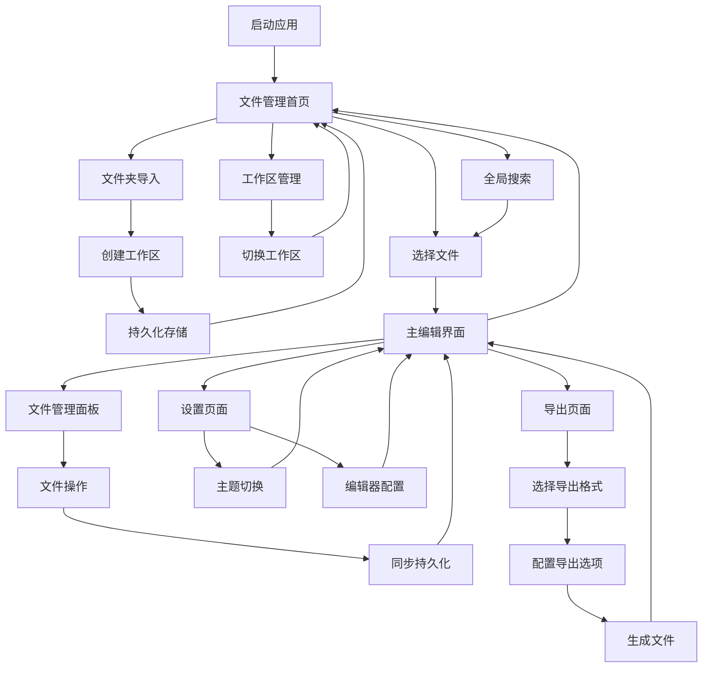

# TyporaMin 产品需求文档 (PRD)

## 1. 产品概述

TyporaMin是一款基于TypeScript开发的跨平台桌面Markdown编辑器，致力于提供简洁、高效的写作体验。产品采用WYSIWYG（所见即所得）编辑模式，让用户专注于内容创作而非格式标记，支持实时预览、主题定制和多格式导出功能。

- **核心价值**：为写作者提供无干扰的Markdown编辑环境，提升写作效率和体验
- **目标用户**：技术文档编写者、博客作者、学生、研究人员等需要高质量文档编辑的用户群体
- **市场定位**：对标Typora，打造开源免费的专业级Markdown编辑器

## 2. 核心功能

### 2.1 用户角色
本产品面向个人用户，无需复杂的角色权限管理，所有用户享有完整的功能权限。

### 2.2 功能模块
TyporaMin包含以下核心页面和功能模块：

1. **文件管理首页**：工作区文件夹列表展示、文件夹导入管理、全局文件搜索、最近访问记录、持久化存储管理
2. **主编辑界面**：WYSIWYG编辑器、实时预览、工具栏、状态栏
3. **文件管理面板**：文件树导航、文件操作、文件夹结构管理、批量操作
4. **设置页面**：主题选择、编辑器配置、导出设置、快捷键配置
5. **导出预览页面**：多格式导出预览、导出选项配置

### 2.3 页面详情

| 页面名称 | 模块名称 | 功能描述 |
|---------|---------|---------|
| 文件管理首页 | 工作区列表 | 展示所有已导入的工作区，每个工作区显示文件夹名称、文件数量、最后访问时间，支持工作区切换和管理 |
| 文件管理首页 | 文件夹结构展示 | 树形结构展示当前工作区的文件夹层级，支持展开/折叠、层级导航、文件夹重命名和删除操作 |
| 文件管理首页 | 持久化管理 | 所有通过文件夹导入的文件和文件夹结构都自动持久化到本地存储，支持离线访问和跨会话保持 |
| 文件管理首页 | 全局搜索 | 跨工作区的文件搜索功能，支持文件名、内容搜索，实时搜索结果展示 |
| 文件管理首页 | 导入管理 | 文件夹批量导入、单文件导入、拖拽导入，自动创建工作区并持久化所有文件 |
| 文件管理首页 | 最近访问面板 | 显示最近打开的文件和工作区，支持快速访问、固定和移除功能 |
| 主编辑界面 | WYSIWYG编辑器 | 实时Markdown编辑，支持语法高亮、自动补全、智能缩进。支持GFM语法、数学公式、表格、任务列表等 |
| 主编辑界面 | 实时预览 | 无缝集成的预览模式，支持滚动同步、点击定位、样式渲染 |
| 主编辑界面 | 工具栏 | 常用格式化按钮、文件操作、视图切换、导出功能快速访问 |
| 主编辑界面 | 状态栏 | 显示字数统计、行列信息、编码格式、语法模式 |
| 文件管理面板 | 文件树 | 展示当前工作区文件夹结构，支持拖拽、重命名、新建、删除操作 |
| 文件管理面板 | 文件操作 | 文件的创建、删除、重命名、移动等基础操作，所有操作自动同步到持久化存储 |
| 文件管理面板 | 批量操作 | 支持多选文件进行批量删除、移动、导出等操作 |
| 设置页面 | 主题管理 | 内置多种主题，支持明暗模式切换、自定义CSS导入 |
| 设置页面 | 编辑器配置 | 字体设置、行号显示、自动保存、语法偏好配置 |
| 导出页面 | 格式选择 | 支持PDF、HTML、Word、图片等多种格式导出 |
| 导出页面 | 样式配置 | 导出样式自定义、页面设置、水印添加 |

## 3. 核心流程

**主要用户操作流程：**

用户启动应用后进入文件管理首页，首页主要展示已导入的工作区列表和文件夹结构。用户可以通过文件夹导入功能批量导入整个文件夹，系统会自动创建工作区并将所有文件和文件夹结构持久化保存到本地存储中。首页的核心区域展示当前活跃工作区的文件夹树形结构，用户可以展开/折叠文件夹、浏览文件层级、使用全局搜索功能快速定位目标文件。点击任意文件后进入编辑界面，编辑器左侧的文件管理面板显示完整的文件树，所有文件操作都会自动同步到持久化存储。用户可以随时返回首页切换工作区或导入新的文件夹，所有数据都会保持持久化状态。

**页面导航流程图：**

## 4. 用户界面设计

### 4.1 设计风格

- **主色调**：#2C3E50（深蓝灰）、#3498DB（亮蓝）
- **辅助色**：#ECF0F1（浅灰）、#95A5A6（中灰）、#E74C3C（警告红）
- **按钮样式**：圆角矩形设计，支持悬停和点击状态反馈
- **字体**：主要使用系统默认字体，代码区域使用等宽字体（Consolas、Monaco）
- **布局风格**：简洁的分栏布局，左侧文件树，右侧编辑区域，可折叠侧边栏
- **图标风格**：使用简洁的线性图标，支持主题色彩适配

### 4.2 页面设计概览

| 页面名称 | 模块名称 | UI元素 |
|---------|---------|--------|
| 文件管理首页 | 工作区列表区域 | 顶部工作区选择器，显示当前活跃工作区名称，支持下拉切换其他工作区 |
| 文件管理首页 | 文件夹树形展示 | 主要内容区域，树形结构展示文件夹层级，支持图标、文件夹名称、文件数量显示，可展开/折叠 |
| 文件管理首页 | 搜索栏 | 顶部搜索框，支持实时搜索，带有过滤选项（文件类型、修改时间等） |
| 文件管理首页 | 导入区域 | 右上角导入按钮组，支持文件夹导入、单文件导入，带有拖拽导入提示区域 |
| 文件管理首页 | 最近访问面板 | 右侧边栏，显示最近打开的文件列表，支持快速访问 |
| 主编辑界面 | 编辑器区域 | 全屏编辑器，支持语法高亮，字体大小14-18px，行高1.6，背景色根据主题调整 |
| 主编辑界面 | 工具栏 | 顶部固定工具栏，高度40px，包含文件操作、格式化、视图切换按钮 |
| 主编辑界面 | 状态栏 | 底部状态栏，高度24px，显示文档信息和编辑状态 |
| 文件管理面板 | 侧边栏 | 左侧可折叠面板，宽度200-300px，树形结构展示，支持拖拽操作 |
| 设置页面 | 选项卡界面 | 分类选项卡设计，左侧导航，右侧配置面板，响应式布局 |
| 导出页面 | 预览界面 | 分屏设计，左侧选项配置，右侧实时预览，支持缩放和滚动 |

### 4.3 响应式设计

TyporaMin主要面向桌面端用户，采用桌面优先的设计策略。应用支持窗口大小调整，最小宽度800px，最小高度600px。界面元素支持自适应缩放，确保在不同屏幕尺寸下的良好体验。侧边栏支持折叠隐藏，为编辑区域提供更大空间。