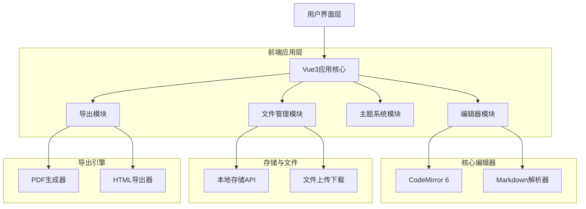
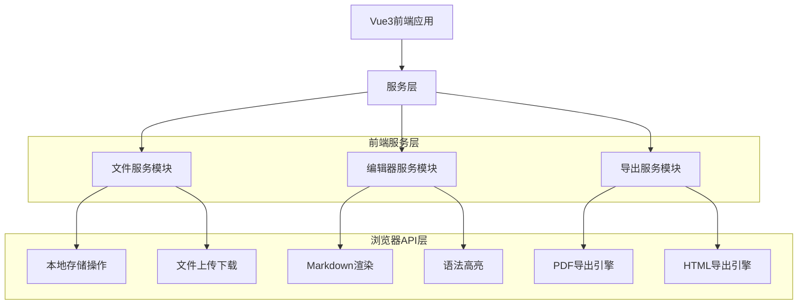
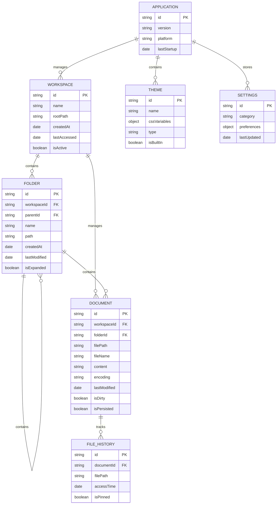

# TyporaMin 技术架构文档

## 1. 架构设计



## 2. 技术描述

* **前端**: Vue\@3 + TypeScript\@5 + Vite\@5 + Tailwind CSS\@3

* **应用类型**: 现代化Web应用 (可后续迁移至桌面)

* **编辑器**: CodeMirror\@6

* **Markdown解析**: Marked\@11 + highlight.js\@11

* **UI组件**: Element Plus\@2 + Lucide Vue Next\@0.5

* **状态管理**: Pinia\@2

* **文件处理**: Tauri原生文件API

* **导出功能**: 基于Tauri的原生导出能力

## 3. 路由定义

| 路由        | 用途                       |
| --------- | ------------------------ |
| /         | 文件管理首页，展示文件夹列表、文件搜索、导入管理等功能 |
| /editor   | 主编辑界面，包含编辑器、文件树、工具栏等核心功能 |
| /settings | 设置页面，包含主题配置、编辑器偏好、快捷键设置  |
| /export   | 导出页面，提供多格式导出选项和预览功能      |
| /about    | 关于页面，显示应用信息、版本号、开源协议     |

## 4. API定义

### 4.1 核心API

**文件操作相关**

```
POST /api/file/open
```

Request:

| 参数名称     | 参数类型   | 是否必需 | 描述       |
| -------- | ------ | ---- | -------- |
| filePath | string | true | 要打开的文件路径 |

Response:

| 参数名称     | 参数类型    | 描述     |
| -------- | ------- | ------ |
| success  | boolean | 操作是否成功 |
| content  | string  | 文件内容   |
| encoding | string  | 文件编码格式 |

Example:

```json
{
  "filePath": "C:/Documents/example.md"
}
```

**文件保存相关**

```
POST /api/file/save
```

Request:

| 参数名称     | 参数类型   | 是否必需  | 描述           |
| -------- | ------ | ----- | ------------ |
| filePath | string | true  | 保存文件路径       |
| content  | string | true  | 文件内容         |
| encoding | string | false | 编码格式，默认utf-8 |

Response:

| 参数名称    | 参数类型    | 描述     |
| ------- | ------- | ------ |
| success | boolean | 保存是否成功 |
| message | string  | 操作结果信息 |

**导出功能相关**

```
POST /api/export/pdf
```

Request:

| 参数名称    | 参数类型          | 是否必需  | 描述         |
| ------- | ------------- | ----- | ---------- |
| content | string        | true  | Markdown内容 |
| options | ExportOptions | false | 导出配置选项     |

Response:

| 参数名称     | 参数类型    | 描述     |
| -------- | ------- | ------ |
| success  | boolean | 导出是否成功 |
| filePath | string  | 导出文件路径 |

## 5. 服务器架构图



## 6. 数据模型

### 6.1 数据模型定义



### 6.2 数据定义语言

**应用配置存储 (使用本地JSON文件)**

```typescript
// Vue3 + Pinia 状态管理接口定义
import { defineStore } from 'pinia'
import { ref, computed } from 'vue'

// 应用设置接口定义
interface AppSettings {
  id: string;
  theme: {
    current: string;
    customThemes: Theme[];
  };
  editor: {
    fontSize: number;
    fontFamily: string;
    lineHeight: number;
    wordWrap: boolean;
    showLineNumbers: boolean;
    autoSave: boolean;
    autoSaveInterval: number;
  };
  export: {
    defaultFormat: 'pdf' | 'html' | 'docx';
    pdfOptions: PDFExportOptions;
    htmlOptions: HTMLExportOptions;
  };
  recentFiles: FileHistoryItem[];
  workspaces: Workspace[];
  activeWorkspaceId?: string;
  shortcuts: KeyboardShortcuts;
  window: {
    width: number;
    height: number;
    x?: number;
    y?: number;
    isMaximized: boolean;
  };
}

// 工作区模型接口
interface Workspace {
  id: string;
  name: string;
  rootPath: string;
  createdAt: Date;
  lastAccessed: Date;
  isActive: boolean;
}

// 文件夹模型接口
interface Folder {
  id: string;
  workspaceId: string;
  parentId?: string;
  name: string;
  path: string;
  createdAt: Date;
  lastModified: Date;
  isExpanded: boolean;
  children?: Folder[];
  documents?: Document[];
}

// 文档模型接口 (Vue3 响应式)
interface Document {
  id: string;
  workspaceId: string;
  folderId?: string;
  filePath: string;
  fileName: string;
  content: string;
  encoding: string;
  isDirty: boolean;
  lastModified: Date;
  isPersisted: boolean;
  cursorPosition: {
    line: number;
    column: number;
  };
  scrollPosition: number;
}

// 主题模型接口
interface Theme {
  id: string;
  name: string;
  type: 'light' | 'dark';
  isBuiltIn: boolean;
  cssVariables: {
    primaryColor: string;
    backgroundColor: string;
    textColor: string;
    borderColor: string;
    accentColor: string;
  };
}

// 文件历史记录
interface FileHistoryItem {
  id: string;
  documentId: string;
  workspaceId: string;
  filePath: string;
  fileName: string;
  accessTime: Date;
  isPinned: boolean;
}

// 导出选项接口
interface ExportOptions {
  format: 'pdf' | 'html' | 'docx' | 'png';
  theme?: string;
  includeCSS?: boolean;
  pageSize?: 'A4' | 'Letter' | 'Legal';
  margin?: {
    top: number;
    right: number;
    bottom: number;
    left: number;
  };
}

// Pinia Store 定义示例
export const useAppStore = defineStore('app', () => {
  // 响应式状态
  const settings = ref<AppSettings>({} as AppSettings)
  const currentDocument = ref<Document | null>(null)
  const recentFiles = ref<FileHistoryItem[]>([])
  const workspaces = ref<Workspace[]>([])
  const activeWorkspace = ref<Workspace | null>(null)
  const folderStructure = ref<Folder[]>([])
  
  // 计算属性
  const isDarkMode = computed(() => 
    settings.value.theme?.current?.includes('dark') ?? false
  )
  
  // 方法
  const updateSettings = (newSettings: Partial<AppSettings>) => {
    settings.value = { ...settings.value, ...newSettings }
  }
  
  const setCurrentDocument = (doc: Document) => {
    currentDocument.value = doc
  }
  
  const createWorkspace = (name: string, rootPath: string) => {
    const workspace: Workspace = {
      id: generateId(),
      name,
      rootPath,
      createdAt: new Date(),
      lastAccessed: new Date(),
      isActive: true
    }
    workspaces.value.push(workspace)
    activeWorkspace.value = workspace
    return workspace
  }
  
  const loadFolderStructure = async (files: FileList) => {
    // 解析文件夹结构并持久化存储
    const folders = await parseFolderStructure(files)
    folderStructure.value = folders
    
    // 创建或更新工作区
    if (files.length > 0) {
      const rootPath = extractRootPath(files)
      const workspaceName = extractWorkspaceName(rootPath)
      createWorkspace(workspaceName, rootPath)
    }
  }
  
  return {
    settings,
    currentDocument,
    recentFiles,
    workspaces,
    activeWorkspace,
    folderStructure,
    isDarkMode,
    updateSettings,
    setCurrentDocument,
    createWorkspace,
    loadFolderStructure
  }
})
```

**本地存储结构**

```json
// ~/.typoraMin/settings.json
{
  "id": "app-settings",
  "version": "1.0.0",
  "theme": {
    "current": "default-light",
    "customThemes": []
  },
  "editor": {
    "fontSize": 16,
    "fontFamily": "system-ui",
    "lineHeight": 1.6,
    "wordWrap": true,
    "showLineNumbers": false,
    "autoSave": true,
    "autoSaveInterval": 30000
  },
  "workspaces": [
    {
      "id": "workspace-1",
      "name": "我的项目",
      "rootPath": "/path/to/project",
      "createdAt": "2024-01-15T10:00:00Z",
      "lastAccessed": "2024-01-15T15:30:00Z",
      "isActive": true
    }
  ],
  "activeWorkspaceId": "workspace-1",
  "recentFiles": [
    {
      "id": "file-1",
      "documentId": "doc-1",
      "workspaceId": "workspace-1",
      "filePath": "/path/to/document.md",
      "fileName": "document.md",
      "accessTime": "2024-01-15T10:30:00Z",
      "isPinned": false
    }
  ]
}

// ~/.typoraMin/workspaces/workspace-1/folders.json
{
  "workspaceId": "workspace-1",
  "folders": [
    {
      "id": "folder-1",
      "workspaceId": "workspace-1",
      "parentId": null,
      "name": "docs",
      "path": "/path/to/project/docs",
      "createdAt": "2024-01-15T10:00:00Z",
      "lastModified": "2024-01-15T15:30:00Z",
      "isExpanded": true,
      "children": [
        {
          "id": "folder-2",
          "workspaceId": "workspace-1",
          "parentId": "folder-1",
          "name": "api",
          "path": "/path/to/project/docs/api",
          "createdAt": "2024-01-15T10:00:00Z",
          "lastModified": "2024-01-15T15:30:00Z",
          "isExpanded": false
        }
      ]
    }
  ]
}

// ~/.typoraMin/workspaces/workspace-1/documents.json
{
  "workspaceId": "workspace-1",
  "documents": [
    {
      "id": "doc-1",
      "workspaceId": "workspace-1",
      "folderId": "folder-1",
      "filePath": "/path/to/project/docs/README.md",
      "fileName": "README.md",
      "content": "# 项目文档\n\n这是项目的主要文档...",
      "encoding": "utf-8",
      "isDirty": false,
      "lastModified": "2024-01-15T15:30:00Z",
      "isPersisted": true,
      "cursorPosition": {
        "line": 1,
        "column": 0
      },
      "scrollPosition": 0
    }
  ]
}
```

